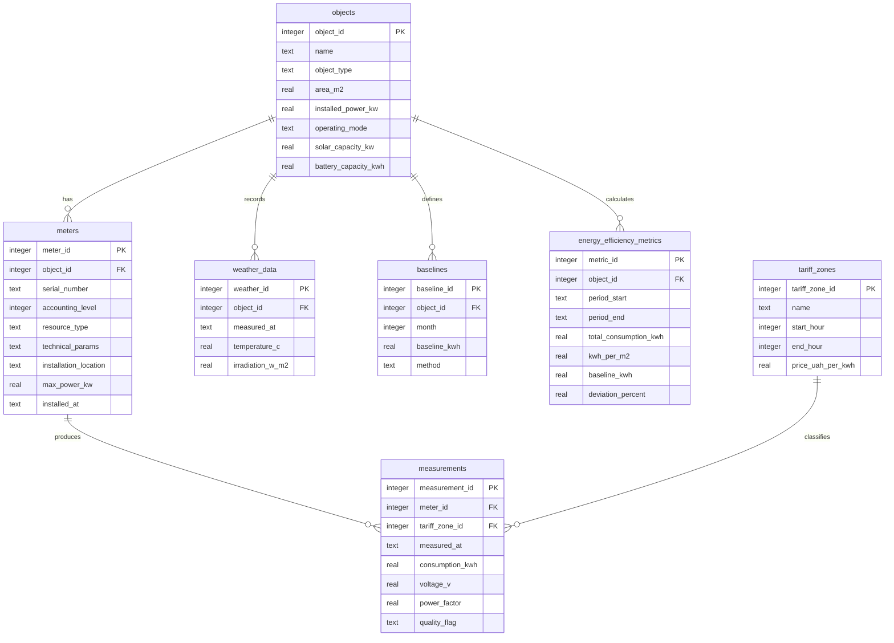

# ER Diagram

```mermaid
erDiagram
    objects ||--o{ meters : has
    objects ||--o{ weather_data : records
    objects ||--o{ baselines : defines
    objects ||--o{ energy_efficiency_metrics : calculates
    meters ||--o{ measurements : produces
    tariff_zones ||--o{ measurements : classifies

    objects {
        integer object_id PK
        text name
        text object_type
        real area_m2
        real installed_power_kw
        text operating_mode
        real solar_capacity_kw
        real battery_capacity_kwh
    }

    meters {
        integer meter_id PK
        integer object_id FK
        text serial_number
        integer accounting_level
        text resource_type
        text technical_params
        text installation_location
        real max_power_kw
        text installed_at
    }

    measurements {
        integer measurement_id PK
        integer meter_id FK
        integer tariff_zone_id FK
        text measured_at
        real consumption_kwh
        real voltage_v
        real power_factor
        text quality_flag
    }

    weather_data {
        integer weather_id PK
        integer object_id FK
        text measured_at
        real temperature_c
        real irradiation_w_m2
    }

    tariff_zones {
        integer tariff_zone_id PK
        text name
        integer start_hour
        integer end_hour
        real price_uah_per_kwh
    }

    baselines {
        integer baseline_id PK
        integer object_id FK
        integer month
        real baseline_kwh
        text method
    }

    energy_efficiency_metrics {
        integer metric_id PK
        integer object_id FK
        text period_start
        text period_end
        real total_consumption_kwh
        real kwh_per_m2
        real baseline_kwh
        real deviation_percent
    }
```
