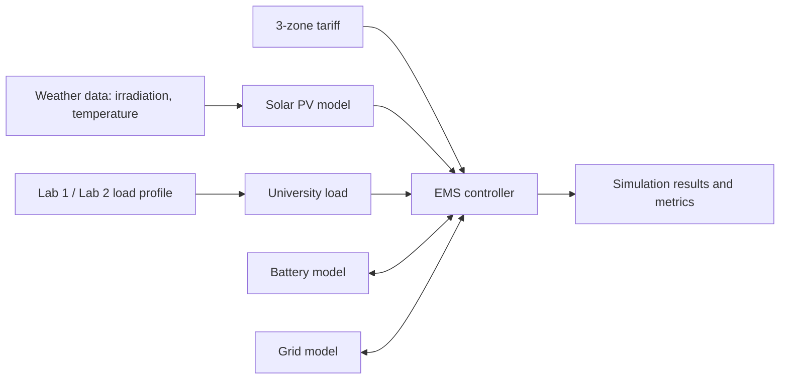

# Lab 3 EMS Architecture

```mermaid
flowchart LR
    Weather["Weather data: irradiation, temperature"] --> PV["Solar PV model"]
    LoadData["Lab 1 / Lab 2 load profile"] --> Load["University load"]
    Tariff["3-zone tariff"] --> EMS["EMS controller"]
    PV --> EMS
    Load --> EMS
    Battery["Battery model"] <--> EMS
    Grid["Grid model"] <--> EMS
    EMS --> Results["Simulation results and metrics"]
```
