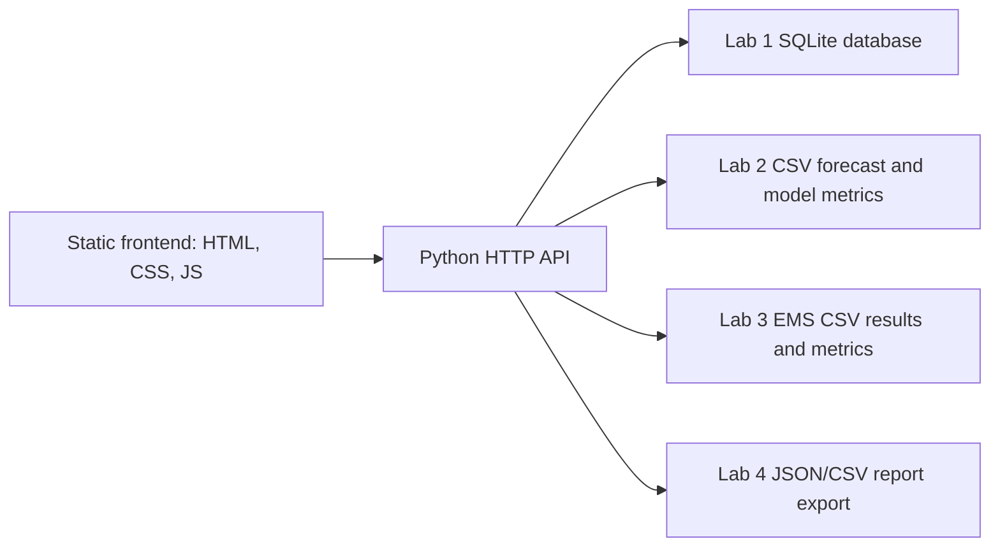

# Lab 4 Report

**Theme:** Web interface for monitoring and control  
**Discipline:** Програмне забезпечення енергетичного менеджменту  
**Student:** Pashchenko Mykola  
**Group:** TR-51mp  
**Variant:** 8, University

## Goal

The goal of Lab 4 is to create a web application that combines the outputs of Labs 1-3 into one information system. The application supports historical consumption review, aggregated analytics, baseline comparison, forecast display, EMS monitoring, and report export.

## Architecture



## Backend

The backend is implemented with Python standard-library `http.server`, because FastAPI/Uvicorn were not installed locally. It still provides REST-style JSON endpoints and a simple API documentation page at `/docs`.

Main backend files:

- `app/main.py`
- `app/services/data_service.py`
- `app/services/report_service.py`

## Frontend

The frontend is a single-page operational dashboard served from `app/static/`.

Sections:

- Overview dashboard.
- Consumption charts.
- Forecast.
- EMS control panel.
- Reports and export.

## Visualizations

Implemented visualization types:

- Line chart for historical consumption.
- Bar chart for baseline comparison.
- Heatmap for hourly/weekday consumption.
- Line chart for forecast.
- Line chart for EMS energy balance.
- Gauge-style KPI cards.
- Flow-style EMS energy diagram.

## Reports

The report section can create:

- `data/lab4/summary_report.json`
- `data/lab4/exported_report.csv`

## Run Instructions

```powershell
python .\app\main.py
```

Then open:

```text
http://127.0.0.1:8000
```

API docs:

```text
http://127.0.0.1:8000/docs
```

## Deliverables

| Requirement | Location |
| --- | --- |
| Backend API code | `app/main.py`, `app/services/` |
| Frontend code | `app/static/` |
| API documentation | `docs/lab4_api.md`, `/docs` |
| Example report | `data/lab4/summary_report.json`, `data/lab4/exported_report.csv` |
| README instructions | `README.md` |
| Screenshots | `reports/lab4_screenshots/` after manual capture |

## Demo Note

The lab asks for a 3-5 minute video demonstration. The app is ready to demonstrate locally, but the video should be recorded manually with a screen recorder.
